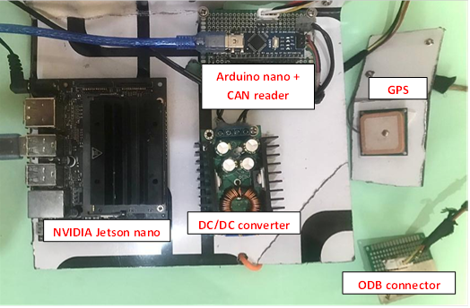
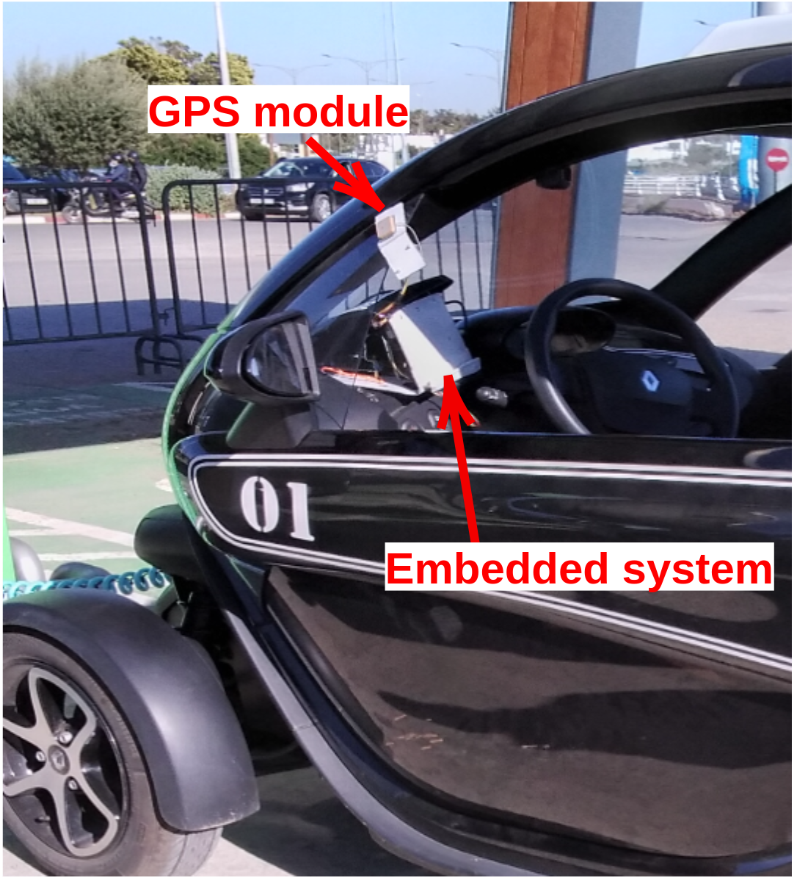
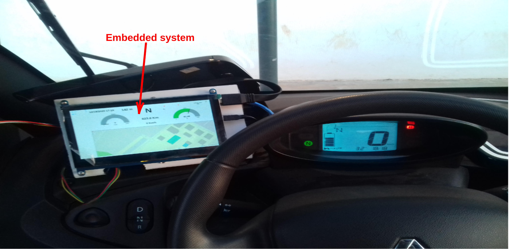
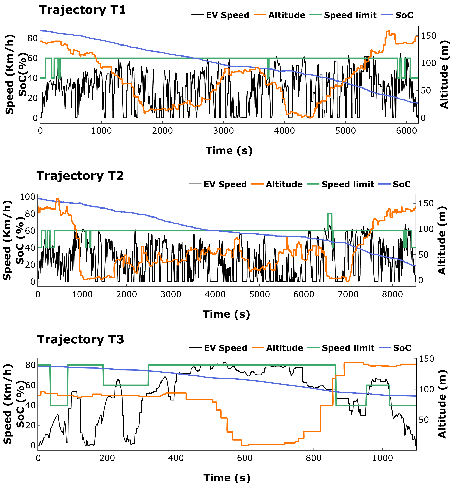

# Introduction
---
This repository contains the dataset collected from a Twizy electric vehicle in the roads of Rabat-Sale-Kenetra
(RSK), Morocco.
During the collect of the dataset (the collect process take place in different days, between March to July 2021), three main trajectories were selected; T1,T2 and T3.
* The **T1** trajectory is done mostly in an urban road with a segment in a ring road (**red** in the figure
  bellow), it is 48 Km long with an average driving time of 1h30minutes.
* The **T2** trajectory is done in an urban road (**blue** in the figure bellow), is is also 48 Km long, with
  an average driving time of 1h40minutes.
* The **T3** trajectory is done in a ring road (**black** in the figure bellow), it is 16 Km long, with an
  average of 18 minutes.

# Collected data
---
The collected dataset contains the following fields:
* **Date** : The date of the driving cycle (**M**onth/**D**ay/**Y**ear).
* **Time** : The time during the driving cycle (**H**ours:**M**inutes:**S**econds) .
* **SoC**: The battery State of Charge (**%**).
* **Speed**: The vehicle speed  (**Km/h**).
* **Mode**: The driving mode (**N**eutral,**D**rive,**R**everse)
* **LAT**: The vehicles' latitude ($^{\circ}$).
* **LON**: The vehicles' longitude ($^{\circ}$).
* **ALT**: The vehicles' altitude related to the sea (**m**).
* **GpsSpeed**: The vehicle speed acquired from the GPS module (**Km/h**).
* **Temperature**: The external ambient temperature ($^{\circ}$C).
* **Humidity**: The external relative humidity (\%).
* **Weather**: The weather status (**cloudy**, **sunny**, **raining ...).
* **WindSpeed**: The average wind speed (**m/s**).
* **Traffic**: the traffic condition:
    * **0** : low traffic
    * **1** : medium traffic
    * **2** : high traffic
* **SpeedLimit**: The speed limit in the current road segment (**Km/h**).

# Data collection system
---
The data collection system is composed of an embedded system that is deployed in a Renault Twizy. The embedded
system is composed of an NVIDIA Jetson nano, and Arduino micro, a CAN bus protocol module, a GPS module, a boost converter to power the system from the
auxillary battery and a tablet holder which act as a user interface.

# Data simple
---
The figure bellow present a data simple of each trajectory. The data presented in the figure are just the vehicle speed, the road speed limit and the battery SoC.

# References
* Malek, Y. N., Najib, M., Bakhouya, M., & Essaaidi, M. (2021). Multivariate deep learning approach for electric vehicle speed forecasting. Big Data Mining and Analytics, 4(1), 56-64.
* NaitMalek, Y., Najib, M., Lahlou, A., Bakhouya, M., Gaber, J., & Essaaidi, M. (2022). A Hybrid Approach for State-of-Charge Forecasting in Battery-Powered Electric Vehicles. Sustainability, 14(16), 9993.

# License
This data-set is under the [CC-BY-4.0 license](./LICENSE.md).
